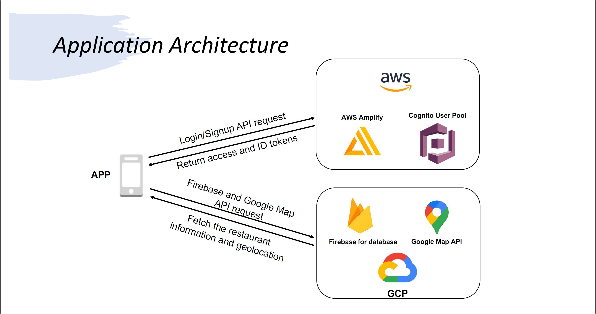

# RestaurantGuidance

# Application functionalities:
* A cloud-based login/signup authentication service from amazon web Servies(AWS) would be integrated in this application.
* A set of restaurents information would be stored in a database on google Cloud platform(GCP).
* Multiple API calls would be applied to retrieve authentication tokens and restaurent information from cloud service.
* A UI including a list view and a map view is implemented to show nearby restaurents with phone numbers, menus, addresses and navigation direction interactively.

# Architecture of Application

# Demo:
https://www.youtube.com/watch?v=XuvQoFEHV5g&feature=youtu.be
